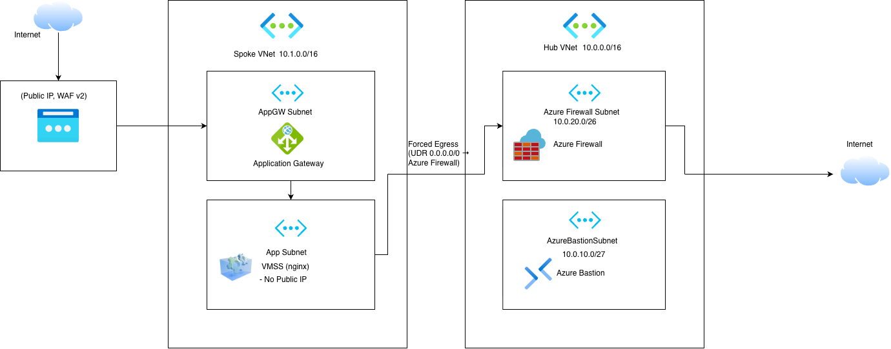
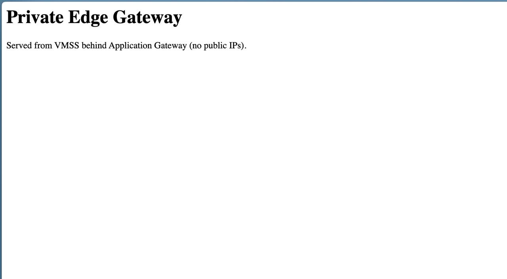
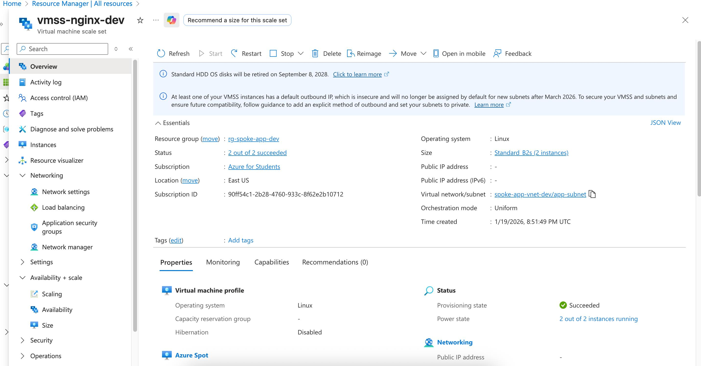
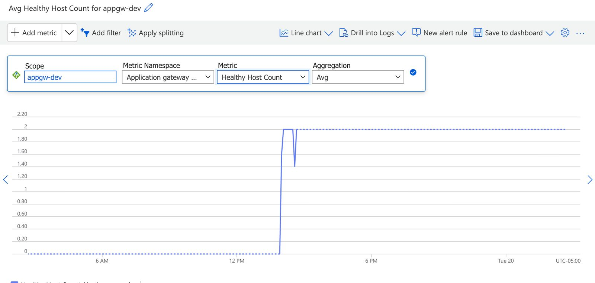
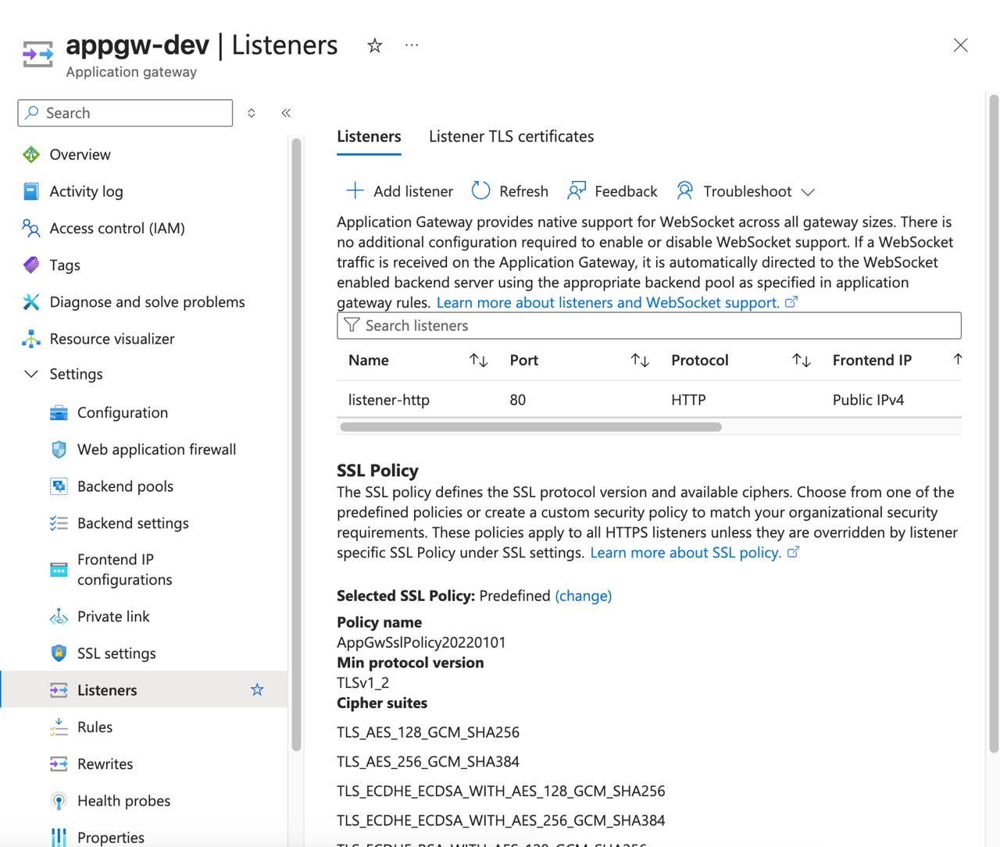
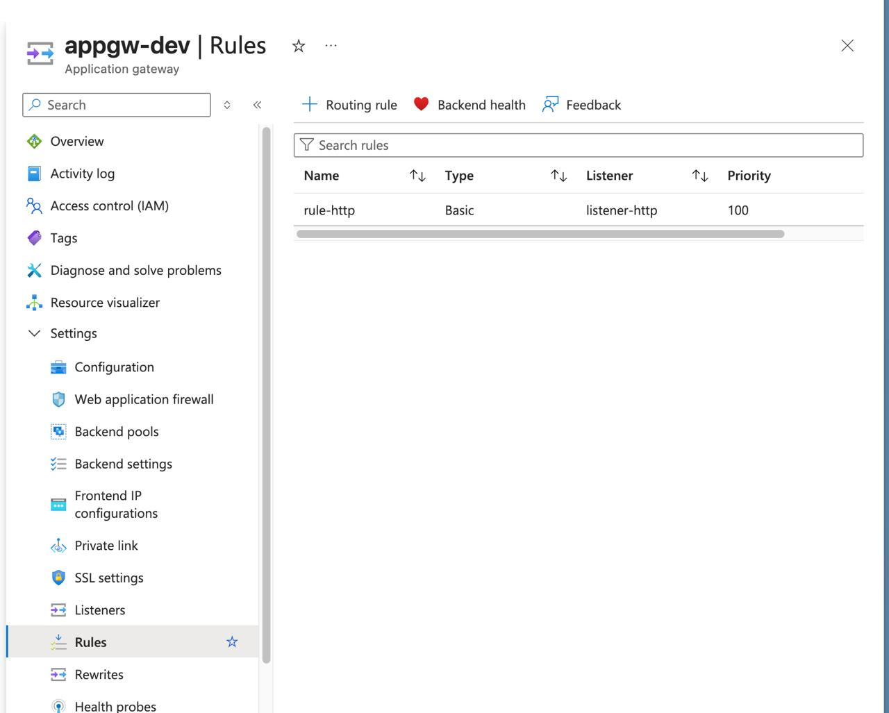
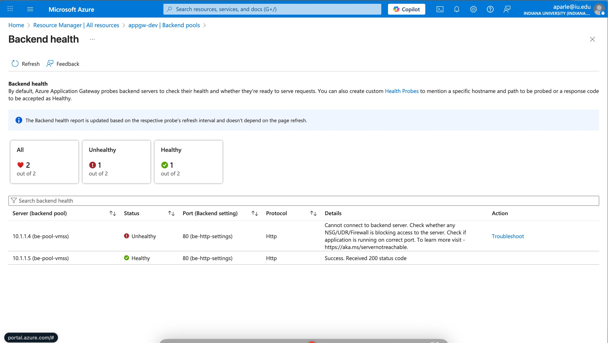
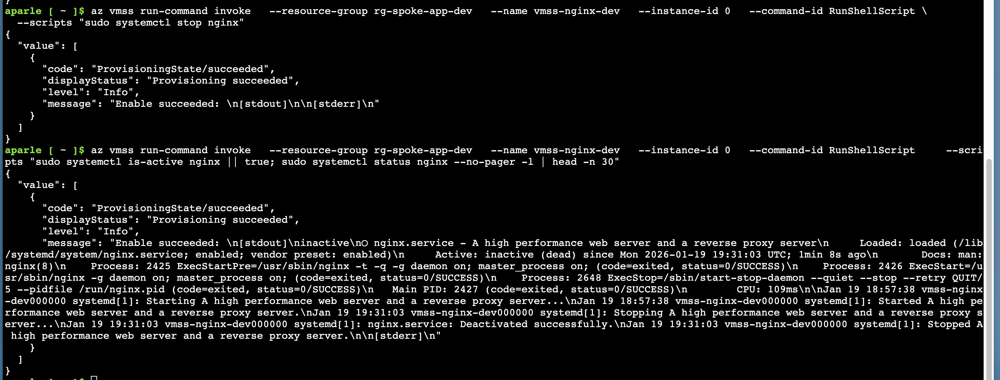

# Private Edge Gateway — Azure (Terraform)

A production-style Azure infrastructure project implementing a **secure edge ingress pattern** using **Azure Application Gateway (WAF_v2)** to route traffic to a **private VM Scale Set** with **no public IP exposure**.

This project demonstrates real-world cloud engineering practices rather than simple resource provisioning.

---

## Architecture Overview

Traffic flow:

Client  
→ Application Gateway (WAF_v2, Public IP)  
→ Backend Pool  
→ VM Scale Set (private subnet, Nginx)

📐 Full architecture diagram:  


Detailed explanation:  
📄 [docs/architecture.md](docs/architecture.md)

---

## Key Features

- **Single public entry point** via Application Gateway (WAF_v2)
- VM Scale Set running Nginx with **no public IPs**
- Hub-and-spoke VNet architecture
- Health probes and backend monitoring
- Forced egress through Azure Firewall
- Incident simulation with documented recovery
- Infrastructure defined using Terraform (IaC)

---

## Validation & Proof

### Application Access
- Application served via Application Gateway public IP  
- Backend instances verified healthy

📸 Evidence:
- 
- 
- 

---

### Monitoring & Observability

- Application Gateway backend health monitoring
- Metrics observed during normal and degraded states

📸 Evidence:
- 
- 
- 

---

## Incident Response

A real failure scenario was simulated and documented.

**Incident:** Backend instance became unhealthy due to Nginx service stoppage.

Observed:
- Backend health degradation
- Potential intermittent 502 responses

Recovered:
- Service restored
- Backend health returned to normal

📄 Incident report:  
[INC-001 – Backend Unhealthy](docs/incidents/INC-001-backend-unhealthy.md)

📸 Evidence:
- 
- 

---

## Deployment (Terraform)

Terraform root directory:
infra/envs/dev

Commands:
```bash
terraform init
terraform fmt -recursive
terraform validate
terraform plan
terraform apply


## Cleanup

terraform destroy

## Notes

This repository is intentionally structured to resemble real cloud operations work, including:

Architecture decisions

Secure networking patterns

Failure detection and recovery

Operational documentation
